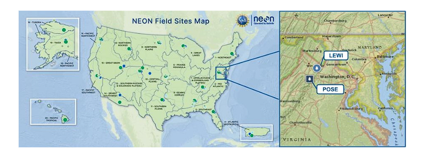
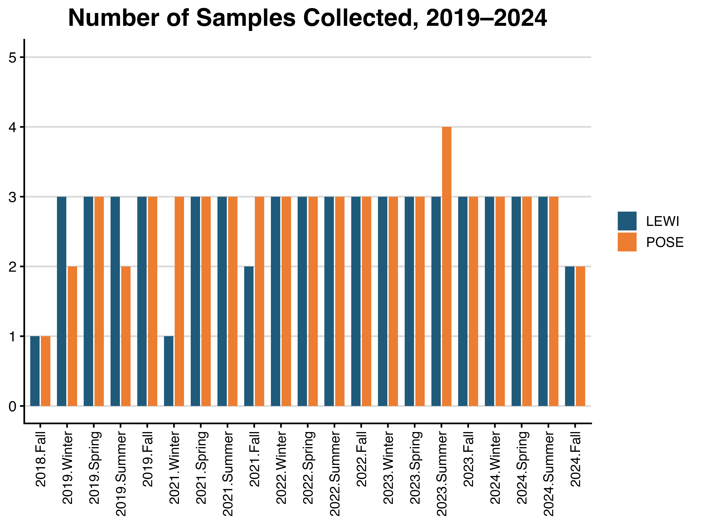
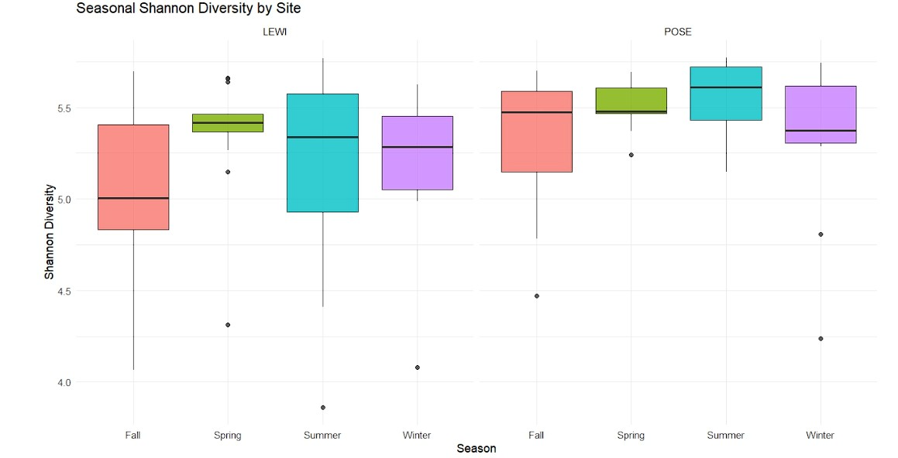
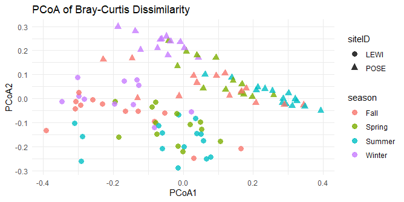

# Seasonal Patterns in Aquatic Microbial Communities Across Freshwater Ecosystems

Graduate capstone project completed as part of the **Master of Science in Biological Data Science** program at **Arizona State University**.

This project investigates seasonal variation in freshwater microbial communities using publicly available 16S rRNA sequencing data from the National Ecological Observatory Network (NEON). Microbial diversity and community composition were evaluated across two freshwater stream ecosystems to determine whether seasonal microbial turnover is consistent across years and between sites.

---

# Project Overview

Freshwater microbial communities are essential to nutrient cycling, carbon processing, and overall ecosystem function. Because environmental conditions fluctuate throughout the year, microbial communities are expected to exhibit recurring seasonal patterns. Understanding whether these seasonal changes are consistent across years provides insight into ecosystem stability and long-term ecological change.

Using publicly available microbial community taxonomy data from the National Ecological Observatory Network (NEON), this project analyzed bacterial and archaeal communities from two freshwater stream sites in Virginia:

- **Posey Creek (POSE)**
- **Lewis Run (LEWI)**

Samples collected between **2019 and 2024** were processed and analyzed using ecological diversity metrics and multivariate statistical techniques implemented in R.

---

# Study Sites



Two NEON freshwater stream sites were included in this study:

- **Posey Creek (POSE)**
- **Lewis Run (LEWI)**

These sites were selected to evaluate whether nearby freshwater ecosystems exhibit similar seasonal microbial community dynamics.

---

# Sampling Overview



Microbial community samples were collected across multiple years and seasons. Following quality control and temporal adjustment, samples from **2019** and **2021–2024** were retained for downstream analyses.

---

# Research Questions

This project addressed two primary questions:

1. Does microbial alpha diversity differ by season and between study sites?
2. Do freshwater microbial communities exhibit repeatable seasonal community structure across years?

---

# Analytical Workflow

The analytical workflow included:

- Importing and merging NEON microbial community datasets
- Data cleaning and quality control
- Construction of genus-level community matrices
- Relative abundance calculations
- Shannon Diversity Index (Alpha Diversity)
- Bray–Curtis Dissimilarity (Beta Diversity)
- Principal Coordinates Analysis (PCoA)
- PERMANOVA
- Statistical modeling and visualization in R

---

# Key Results

Following quality filtering, the final analytical dataset included:

- **106 microbial community samples**
- **3,752 identified genera**

Major findings included:

- Significant differences in alpha diversity by site, year, and season.
- Higher Shannon diversity at Posey Creek (POSE) compared to Lewis Run (LEWI).
- Significant differences in microbial community composition by season and site.
- Seasonal patterns explained only part of the observed community variation, suggesting additional environmental factors contribute to microbial community structure.

---

# Alpha Diversity



Shannon diversity analyses demonstrated significant differences among sites, years, and seasons. Across the study period, microbial diversity was consistently higher at POSE than at LEWI.

---

# Community Composition



Principal Coordinates Analysis (PCoA) based on Bray–Curtis dissimilarity revealed differences in microbial community composition between study sites, with moderate seasonal clustering across years.

---

# Repository Structure

```
analysis/
```

R scripts used for data processing, statistical analyses, and figure generation.

```
figures/
```

Publication-quality figures used in the manuscript.

```
manuscript/
```

Final graduate capstone manuscript.

```
data/
```

Information describing the publicly available NEON datasets used in this study.

---

# Software

- R
- tidyverse
- ggplot2
- vegan
- ggh4x
- readr
- dplyr
- tidyr

---

# Authors

Graduate Capstone Team

- Kathryn Boyd
- Delanie Dickson
- Azriella Turkdogan
- Tyler Jernigan

---

# Citation

If you use this repository or build upon this work, please cite the accompanying manuscript and the National Ecological Observatory Network (NEON) data product:

**NEON Data Product:** DP1.20141.002 – Surface Water Microbe Community Taxonomy
